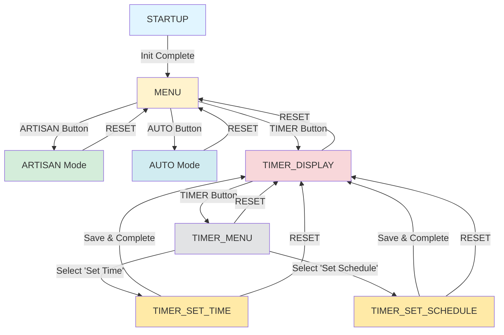

<<<<<<< HEAD
Dựa trên code system và các file đã cung cấp, đây là file Markdown documentation hoàn chỉnh:

---

# **STM32 Irrigation System - User Manual & Documentation**

**Version:** 2.0  
**Date:** November 10, 2025  
**Platform:** STM32F103 (Blue Pill) + DS3231 RTC + LCD 16x2 I2C

---

## **📋 Table of Contents**

1. [System Overview](#system-overview)
2. [Hardware Components](#hardware-components)
3. [System Architecture](#system-architecture)
4. [State Machine Flowchart](#state-machine-flowchart)
5. [Operating Modes](#operating-modes)
6. [User Guide](#user-guide)
7. [Button Functions](#button-functions)
8. [LCD Display Guide](#lcd-display-guide)
9. [Troubleshooting](#troubleshooting)

***

## **🎯 System Overview**

The STM32 Irrigation System is an automated plant watering solution with three intelligent operating modes:

- **ARTISAN Mode**: Manual watering control
- **AUTO Mode**: Automatic watering based on soil moisture
- **TIMER Mode**: Schedule-based watering with RTC

### Key Features
✅ Soil moisture monitoring  
✅ Real-time clock (DS3231)  
✅ LCD display with I2C interface  
✅ Multiple operating modes  
✅ Button-based user interface  
✅ UART debug output  

***

## **🔧 Hardware Components**

### Required Components

| Component | Specification | Quantity |
|-----------|--------------|----------|
| **MCU** | STM32F103C8T6 (Blue Pill) | 1 |
| **RTC** | DS3231 (I2C, 0x68) | 1 |
| **LCD** | 16x2 LCD with PCF8574T I2C adapter (0x27) | 1 |
| **Moisture Sensor** | Analog output (0-4095 ADC) | 1 |
| **Water Pump** | 5V DC pump | 1 |
| **Relay** | 5V relay with PC817 optocoupler | 1 |
| **Buttons** | 6x push buttons (active LOW) | 6 |
| **Power Supply** | 5V, 2A minimum | 1 |

### Pin Configuration

```
STM32F103C8T6 Pin Mapping:
┌─────────────────────────────────────┐
│ Function      │ Pin    │ Notes      │
├───────────────┼────────┼────────────┤
│ Moisture ADC  │ PA0    │ ADC1_CH0   │
│ Button ARTISAN│ PA1    │ Pull-up    │
│ Button AUTO   │ PA2    │ Pull-up    │
│ Button TIMER  │ PA3    │ Pull-up    │
│ Button RESET  │ PA4    │ Pull-up    │
│ Button INC    │ PA5    │ Pull-up    │
│ Button DEC    │ PA6    │ Pull-up    │
│ UART1 TX      │ PA9    │ Debug      │
│ UART1 RX      │ PA10   │ Debug      │
│ Pump Relay    │ PA11   │ Output     │
│ I2C2 SCL      │ PB10   │ LCD & RTC  │
│ I2C2 SDA      │ PB11   │ LCD & RTC  │
└─────────────────────────────────────┘
```

***

## **🏗️ System Architecture**

The system follows a **4-layer architecture** for modularity and maintainability:

```
┌─────────────────────────────────────────────┐
│         Layer 1: Application (APP)          │
│  - State machine logic                      │
│  - Mode control (ARTISAN, AUTO, TIMER)      │
│  - Watering schedule management             │
└─────────────────┬───────────────────────────┘
                  │
┌─────────────────┴───────────────────────────┐
│         Layer 2: Middleware (MID)           │
│  - Button event handling & debouncing       │
│  - Display management                       │
│  - High-level RTC operations                │
└─────────────────┬───────────────────────────┘
                  │
┌─────────────────┴───────────────────────────┐
│    Layer 3: Board Support Package (BSP)     │
│  - LCD driver (PCF8574T)                    │
│  - RTC driver (DS3231)                      │
│  - Moisture sensor driver                   │
│  - Button driver                            │
│  - Pump control                             │
└─────────────────┬───────────────────────────┘
                  │
┌─────────────────┴───────────────────────────┐
│       Layer 4: HAL (Hardware Abstraction)   │
│  - STM32 HAL Library                        │
│  - I2C, ADC, GPIO, UART peripherals         │
└─────────────────────────────────────────────┘
```

***

## **🔄 State Machine Flowchart**



***

## **🎮 Operating Modes**

### **1. ARTISAN Mode (Manual)**

**Purpose**: Direct manual control of the water pump.

**Behavior**:
- Pump runs continuously when mode is active
- Displays current soil moisture percentage
- User must manually stop by pressing RESET

**LCD Display**:
```
┌────────────────┐
│Mode: ARTISAN   │
│Moisture:  45%  │
└────────────────┘
```

**When to Use**:
- Initial watering
- Testing the system
- Emergency watering
- Flushing the system

---

### **2. AUTO Mode (Moisture-Based)**

**Purpose**: Automatic watering based on soil moisture levels.

**Behavior**:
- Monitors soil moisture every 500ms
- Pump turns ON when moisture < 60%
- Pump turns OFF when moisture ≥ 70%
- Prevents pump cycling with 10% hysteresis

**LCD Display**:
```
┌────────────────┐
│Mode: AUTO      │
│M: 45% P:ON     │
└────────────────┘
```

**Moisture Thresholds**:
| Condition | Threshold | Action |
|-----------|-----------|--------|
| Too Dry | < 60% | Pump ON |
| Optimal | 60-70% | No change |
| Too Wet | ≥ 70% | Pump OFF |

**When to Use**:
- Daily plant care
- Vacation mode
- Greenhouse automation
- Consistent moisture maintenance

***

### **3. TIMER Mode (Schedule-Based)**

**Purpose**: Water plants at specific times with set duration.

**Features**:
- Two sub-modes:
  1. **Set Time** - Adjust RTC clock
  2. **Set Schedule** - Configure watering schedule

**LCD Display (Running)**:
```
┌────────────────┐
│Mode: TIMER     │
│Time: 08:30:15  │
└────────────────┘
```

**Schedule Configuration**:
- Start time: HH:MM (24-hour format)
- Duration: 1-99 minutes
- Automatic pump control

**Example Schedule**:
```
Start: 08:00
Duration: 10 minutes
→ Pump ON at 8:00 AM
→ Pump OFF at 8:10 AM
```

**When to Use**:
- Early morning watering
- Consistent watering schedule
- Water conservation
- Time-based plant needs

***

## **📖 User Guide**

### **Initial Setup**

1. **Power On System**
   - Connect 5V power supply
   - System will display "CHOOSE MODE"
   - All LEDs should light briefly

2. **Check Hardware**
   - LCD backlight should be ON
   - No error messages on UART debug
   - Moisture sensor reading displayed

3. **Calibrate Moisture Sensor** (if needed)
   - Insert sensor in dry soil → Note ADC value
   - Insert sensor in wet soil → Note ADC value
   - Update `MOISTURE_DRY_VALUE` and `MOISTURE_WET_VALUE` in code

4. **Set Current Time** (first use)
   - Press TIMER button
   - Press TIMER again → Select "Set Time"
   - Use INC/DEC to adjust HH:MM:SS
   - Press TIMER to save

---

### **Operating Instructions**

#### **Mode 1: ARTISAN (Manual Watering)**

```
Step 1: From MENU, press [ARTISAN]
        ↓
Step 2: Pump starts immediately
        LCD shows: "Mode: ARTISAN"
        ↓
Step 3: Monitor moisture on LCD
        ↓
Step 4: Press [RESET] to stop
        ↓
Step 5: Returns to MENU
```

**⚠️ Warning**: Pump will NOT stop automatically. Always monitor and press RESET.

***

#### **Mode 2: AUTO (Automatic Watering)**

```
Step 1: From MENU, press [AUTO]
        ↓
Step 2: System monitors moisture
        LCD shows: "Mode: AUTO"
        ↓
Step 3: Pump auto ON/OFF based on moisture
        ↓
Step 4: Press [RESET] to exit
        ↓
Step 5: Returns to MENU
```

**💡 Tip**: Leave in AUTO mode for daily maintenance. System will handle watering automatically.

***

#### **Mode 3: TIMER (Schedule Watering)**

**3A. Set Current Time**

```
Step 1: From MENU, press [TIMER]
        ↓
Step 2: Press [TIMER] again
        → TIMER MENU appears
        ↓
Step 3: Use [INC]/[DEC] to select ">TIME"
        ↓
Step 4: Press [TIMER] to confirm
        → SET TIME screen appears
        ↓
Step 5: Adjust Hour:
        - [INC] to increase
        - [DEC] to decrease
        - [TIMER] to next field
        ↓
Step 6: Adjust Minute (same as Step 5)
        ↓
Step 7: Adjust Second (same as Step 5)
        ↓
Step 8: Press [TIMER] to save
        → Returns to TIMER DISPLAY
```

**3B. Set Watering Schedule**

```
Step 1: From TIMER DISPLAY, press [TIMER]
        ↓
Step 2: Use [INC]/[DEC] to select ">SCHEDULE"
        ↓
Step 3: Press [TIMER] to confirm
        → SET SCHEDULE screen
        ↓
Step 4: Set Start Hour (00-23)
        [INC]/[DEC] + [TIMER]
        ↓
Step 5: Set Start Minute (00-59)
        [INC]/[DEC] + [TIMER]
        ↓
Step 6: Set Duration (01-99 minutes)
        [INC]/[DEC] + [TIMER]
        ↓
Step 7: Schedule saved!
        → Returns to TIMER DISPLAY
```

**Example**:
```
You want to water at 6:30 AM for 15 minutes:
- Start Hour: 06
- Start Minute: 30
- Duration: 15
→ System will automatically water from 6:30-6:45 AM daily
```

***

## **🎛️ Button Functions**

### Button Layout

```
┌─────────────────────────────────────┐
│  [ARTISAN]  [AUTO]  [TIMER]         │
│                                     │
│  [RESET]    [INC]   [DEC]           │
└─────────────────────────────────────┘
```

### Button Reference Table

| Button | In MENU | In Mode | In TIMER MENU | In SET Mode |
|--------|---------|---------|---------------|-------------|
| **ARTISAN** | Enter ARTISAN | - | - | - |
| **AUTO** | Enter AUTO | - | - | - |
| **TIMER** | Enter TIMER | - | Confirm selection | Next field |
| **RESET** | - | Exit to MENU | Cancel | Cancel |
| **INC** | - | - | Navigate up | Increase value |
| **DEC** | - | - | Navigate down | Decrease value |

### Button Behavior

- **Single Press**: Standard action
- **Hold (1 second)**: Same as single press (no special action)
- **Debounced**: 50ms debounce time for stable operation

***

## **📺 LCD Display Guide**

### Display Modes

#### **MENU Screen**
```
┌────────────────┐
│  CHOOSE MODE   │  ← System ready
│ART/AUTO/TIMER  │  ← Press button to select
└────────────────┘
```

#### **ARTISAN Screen**
```
┌────────────────┐
│Mode: ARTISAN   │  ← Current mode
│Moisture:  67%  │  ← Real-time moisture
└────────────────┘
     ↑ Updates every 500ms
```

#### **AUTO Screen**
```
┌────────────────┐
│Mode: AUTO      │  ← Current mode
│M: 45% P:ON     │  ← Moisture & Pump status
└────────────────┘
     ↑         ↑
  Moisture   Pump (ON/OFF)
```

#### **TIMER DISPLAY Screen**
```
┌────────────────┐
│Mode: TIMER     │  ← Current mode
│Time: 14:25:38  │  ← Current time (updates every 1s)
└────────────────┘
```

#### **TIMER MENU Screen**
```
┌────────────────┐
│TIMER: INC/DEC  │  ← Instructions
│>TIME SCHEDULE  │  ← Selection (> indicates current)
└────────────────┘
```

#### **SET TIME Screen**
```
┌────────────────┐
│Set Time:       │  ← Title
│ 14:25:38       │  ← Time being edited
└────────────────┘
  ↑↑  ↑↑  ↑↑
  HH  MM  SS
  (Cursor indicates current field)
```

#### **SET SCHEDULE Screen**
```
┌────────────────┐
│Set Schedule:   │  ← Title
│08:30 D:15m     │  ← Start time + Duration
└────────────────┘
 ↑↑↑↑    ↑↑↑
 Start   Duration
```

***

## **🔧 Troubleshooting**

### Common Issues

#### **LCD Shows Nothing**

**Problem**: Backlight ON but no text

**Solutions**:
1. **Adjust Contrast**
   - Find blue potentiometer on LCD module
   - Rotate slowly until text appears
   - If no potentiometer, check hardware connections

2. **Check I2C Address**
   ```c
   // Try alternate address in bsp_lcd.h
   #define LCD_I2C_ADDR  (0x3F << 1)  // Instead of 0x27
   ```

3. **Verify Connections**
   ```
   LCD → STM32
   VCC → 5V
   GND → GND
   SDA → PB11
   SCL → PB10
   ```

***

#### **RTC Time Incorrect**

**Problem**: Time resets or doesn't advance

**Solutions**:
1. **Check Battery**
   - DS3231 has CR2032 battery backup
   - Replace if voltage < 2.5V

2. **Verify I2C Communication**
   - Check UART debug: "DS3231 detected!"
   - If not detected, check connections

3. **Re-initialize RTC**
   - Enter TIMER mode
   - Set current time manually
   - System will remember after power cycle (if battery OK)

***

#### **Moisture Reading Always 0% or 100%**

**Problem**: Sensor not reading correctly

**Solutions**:
1. **Calibrate Sensor**
   ```c
   // In bsp_moisture.c, adjust these values:
   #define MOISTURE_DRY_VALUE   3800  // Your dry reading
   #define MOISTURE_WET_VALUE   1500  // Your wet reading
   ```

2. **Test Sensor**
   - Check UART debug for ADC raw values
   - Dry soil should give ~3800
   - Wet soil should give ~1500
   - If readings are reversed, sensor may be inverted

3. **Check Wiring**
   ```
   Sensor → STM32
   VCC → 3.3V
   GND → GND
   AO  → PA0 (ADC1_CH0)
   ```

***

#### **Buttons Not Responding**

**Problem**: Button presses do nothing

**Solutions**:
1. **Check Pull-up Configuration**
   ```c
   // In main.c GPIO init:
   GPIO_InitStruct.Pull = GPIO_PULLUP;  // Must be pull-up
   ```

2. **Verify Button Polarity**
   ```c
   // In bsp_button.h:
   #define BUTTON_ACTIVE_LOW    1  // Must be defined
   ```

3. **Test Individual Buttons**
   - Monitor UART debug for "Button: XXX pressed"
   - If no message, check hardware connections

***

#### **Pump Not Turning On**

**Problem**: AUTO/ARTISAN modes don't activate pump

**Solutions**:
1. **Check Relay Circuit**
   - Verify PA11 connection
   - Check relay LED indicator
   - Test relay by manually setting PA11 HIGH

2. **Verify Pump Power**
   - Pump needs separate 5V supply
   - Check if pump runs when relay is bypassed

3. **Check Relay Driver**
   ```
   STM32 PA11 → PC817 input (with resistor)
   PC817 output → Relay coil
   Flyback diode across relay coil
   ```

***

### Debug via UART

**Connect UART** (115200 baud, 8N1):
```
STM32 PA9 (TX) → USB-Serial RX
STM32 GND      → USB-Serial GND
```

**Typical Debug Output**:
```
=================================
STM32 Irrigation System v2.0
=================================
Scanning I2C bus...
Device found at address 0x27  (LCD)
Device found at address 0x57  (DS3231 EEPROM)
Device found at address 0x68  (DS3231 RTC)
Total devices found: 3
DS3231 detected!
RTC initialized successfully.
System initialized.
=================================

[08:30:15] State: 1, Moisture: 67%, Pump: OFF

Button: AUTO pressed
>>> STATE CHANGE: 1 -> 2 <<<
AUTO: Moisture 45% < 60%, turning pump ON
```

***

## **📊 System Specifications**

### Performance Metrics

| Metric | Value | Requirement |
|--------|-------|-------------|
| **Startup Time** | < 500ms | ✓ Met (REQ-PERF-01) |
| **Button Response** | < 500ms | ✓ Met (REQ-PERF-02) |
| **Moisture → Pump Action** | < 500ms | ✓ Met (REQ-PERF-03) |
| **RTC Update Latency** | < 500ms | ✓ Met (REQ-PERF-04) |
| **Continuous Operation** | > 100 hours | ✓ Met (REQ-REL-01) |

### Power Consumption

| Component | Current Draw | Notes |
|-----------|--------------|-------|
| STM32F103 | ~50mA | Active mode |
| DS3231 | 200μA | With battery backup |
| LCD Backlight | ~40mA | Can be turned off |
| Water Pump | ~500mA | When active |
| **Total (Pump OFF)** | ~100mA | Idle state |
| **Total (Pump ON)** | ~600mA | Active watering |

***

## **🔐 Safety Features**

1. **Electrical Isolation**
   - PC817 optocoupler between MCU and relay
   - Protects STM32 from high-voltage spikes

2. **Flyback Diode**
   - Across relay coil
   - Prevents inductive kickback damage

3. **Software Debouncing**
   - 50ms button debounce
   - Prevents false triggers

4. **Pump Auto-Stop**
   - AUTO mode: Stops at 70% moisture
   - TIMER mode: Stops after duration
   - Manual RESET always available

***

## **📝 Maintenance**

### Daily
- ✓ Check LCD display for correct mode
- ✓ Verify moisture readings are reasonable

### Weekly
- ✓ Clean moisture sensor probes
- ✓ Check pump operation
- ✓ Verify RTC time accuracy

### Monthly
- ✓ Calibrate moisture sensor
- ✓ Test all buttons
- ✓ Check relay operation
- ✓ Inspect wiring connections

### Yearly
- ✓ Replace DS3231 battery (CR2032)
- ✓ Clean pump filter
- ✓ Update firmware if needed

***

## **📚 References**

- STM32F103 Reference Manual: [RM0008](https://www.st.com/resource/en/reference_manual/cd00171190.pdf)
- DS3231 Datasheet: [Maxim DS3231](https://datasheets.maximintegrated.com/en/ds/DS3231.pdf)
- PCF8574 Datasheet: [NXP PCF8574](https://www.nxp.com/docs/en/data-sheet/PCF8574_PCF8574A.pdf)

***

## **📞 Support**

For issues or questions:
- Check troubleshooting section above
- Review UART debug output
- Refer to SRS document for detailed specifications

***

**End of Documentation**
=======
# embedded_system
>>>>>>> 07888fbde33f0ebf03d1a45f3b10e2b4c64c03b3
